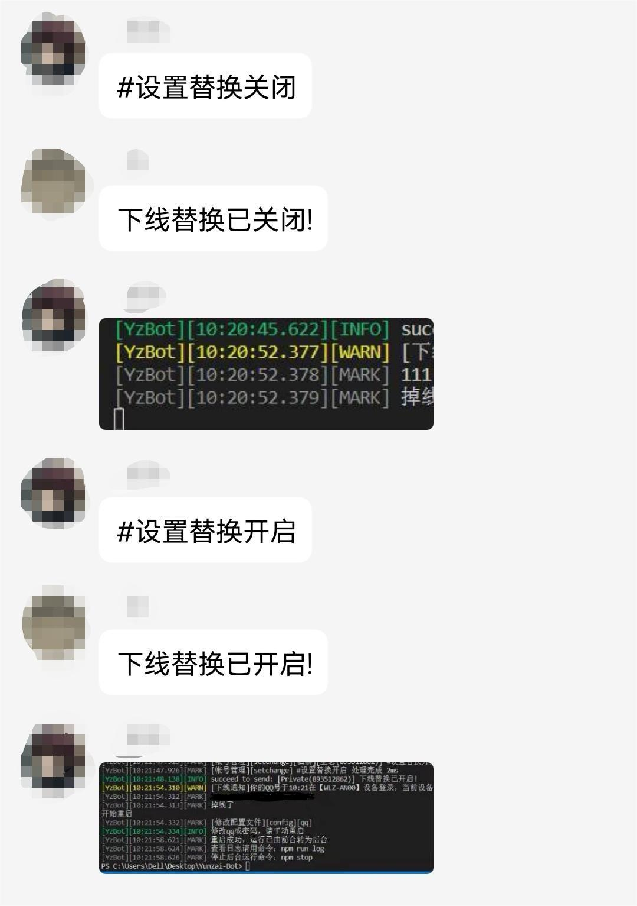

## 介绍

Yunzai插件V3（自行下载到example里即可）  
该插件主要用来进行跨群禁止指令

## 指令

### 指令禁止：  
#禁止+指令（在想要禁止指令的群中）、#禁止+指令+空格+群号（私聊禁止，或禁止指定群聊）  
#开放+指令（同上）  
#列表（主人查看全部群聊和群禁止指令）  
#本群列表（群聊查看该群的禁止指令）  
#更新群列表（可自行更新，也有定时任务进行更新）

### 注意
此插件会在data目录下生成data文件存储数据，且若想要禁止类似#添加之类的指令，需要输入#禁止#添加XX 

### 帐号管理： 
#配置（配置中间可以选择发送“结束”来结束配置。如是扫描登录的，配置密码时发送“无”。同时配置的帐号请注意要通过验证，既data文件下对应qq号的文件里面有token文件。并且配置的设备请与通过验证时的设备保持一致，否则切换帐号时会直接掉线）  
#查看  
#删除配置+数字  
#切换+数字  
#设置替换开启（开启之后，在你的帐号发生掉线之后会在你所配置的帐号中选择另一个帐号重新登录）  

### 部分功能演示： 
配置替换帐号：  

  

配置帐号：  

  

其他的功能自行探索吧，已经尽力把交互做的人性化了

### 注意  
此插件会在recourses文件下生成bot.yaml文件存储配置信息，具体哪些文件放哪里请看文件中的使用说明  
所有命令均为主人专属，#配置命令只支持私聊

后续可能会更新一些方便管理Bot的功能，例如一键跑路之类的

（新手写代码大佬勿喷 (>﹏<)）。。
